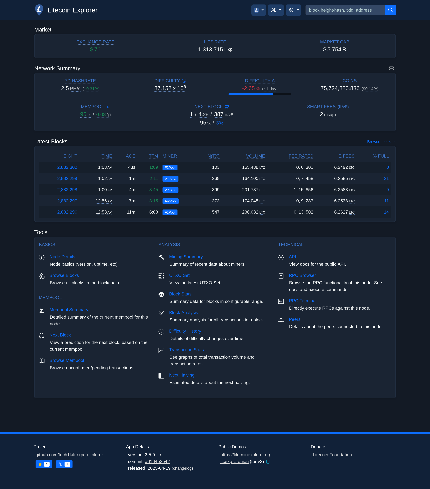

# LTC RPC Explorer

## Self-Hosted Litecoin explorer for everyone running [Litecoin Core](https://github.com/litecoin-project/litecoin).

[![npm version][npm-ver-img]][npm-ver-url] [![NPM downloads][npm-dl-alltime-img]][npm-dl-url]


---





This is a self-hosted explorer for the Litecoin blockchain, driven by RPC calls to your own [Litecoin](https://github.com/litecoin-project/litecoin) node. It is easy to run and can be connected to other tools (like Electrum servers) to achieve a full-featured explorer.

This explorer was originally developed by [janoside](https://github.com/janoside) for Bitcoin. You can find the original Bitcoin version here: [btc-rpc-explorer](https://github.com/janoside/btc-rpc-explorer) Special thanks to him for creating this fantastic explorer.

Whatever reasons you may have for running a full node (trustlessness, technical curiosity, supporting the network, etc) it's valuable to appreciate the *fullness* of your node. With this explorer, you can explore not just the blockchain database, but also explore all of the functional capabilities of your own node.

Please note that this is still in active development to ensure full compatibility with Litecoin, so there may be bugs or areas that need updates. However, the explorer is functional and can be used with Litecoin in its current state. Any and all contributions are much appreciated.

Live demo:

* [LitecoinExplorer.org](https://litecoinexplorer.org)


# Features

* Network Summary dashboard
* View details of blocks, transactions, and addresses
* Analysis tools for viewing stats on blocks, transactions, and miner activity
* JSON REST API
* See raw JSON content from litecoind used to generate most pages
* Search by transaction ID, block hash/height, and address
* Optional transaction history for addresses by querying from Electrum-protocol servers (e.g. ElectrumX), blockchair.com, or blockcypher.com
* Mempool summary, with fee, size, and age breakdowns
* RPC command browser and terminal


# Changelog / Release notes

See [CHANGELOG.md](/CHANGELOG.md).


# Getting started

## Prerequisites

1. Install `Litecoin Core` - [instructions](https://litecoin.com/learning-center/how-to-run-your-own-litecoin-node). Ensure that `Litecoin Core`'s' RPC server is enabled (`server=1`).
2. Allow `Litecoin Core` to synchronize with the Litecoin network (you *can* use this tool while sychronizing, but some pages may fail).
3. Install Node.js (16+ required, 18+ recommended).

### Note about pruning and indexing configurations

This tool is designed to work best with full transaction indexing enabled (`txindex=1`) and pruning **disabled**. 
However, if you're running Litecoin Core v0.21+ you can run *without* `txindex` enabled and/or *with* `pruning` enabled and this tool will continue to function, but some data will be incomplete or missing. Also note that such Litecoin Core configurations receive less thorough testing.

In particular, with `pruning` enabled and/or `txindex` disabled, the following functionality is altered:

* You will only be able to search for mempool, recently confirmed, and wallet transactions by their txid. Searching for non-wallet transactions that were confirmed over 3 blocks ago is only possible if you provide the confirmed block height in addition to the txid.
* Pruned blocks will display basic header information, without the list of transactions. Transactions in pruned blocks will not be available, unless they're wallet-related. Block stats will only work for unpruned blocks.
* The address and amount of previous transaction outputs will not be shown, only the txid:vout.
* The mining fee will only be available for unconfirmed transactions.


## Install / Run

If you're running on mainnet with the default datadir and port, the default configuration should *Just Work*. Otherwise, see the **Configuration** section below.

#### Install via `npm`:

*Note: npm v7+ is required*

```bash
npm install -g ltc-rpc-explorer
ltc-rpc-explorer
```

#### Run from source:

1. `git clone https://github.com/tech1k/ltc-rpc-explorer`
2. `cd ltc-rpc-explorer`
3. `npm install`
4. `npm start`


After a default installation+startup using any of the above methods, the app can be viewed at [http://127.0.0.1:3003/](http://127.0.0.1:3003/)


## Configuration

Configuration options may be set via environment variables or CLI arguments.

#### Configuration with environment variables

To configure with environment variables, you need to create one of the 2 following files and enter values in it:

1. `~/.config/ltc-rpc-explorer.env`
2. `.env` in the working directory for ltc-rpc-explorer

In either case, refer to [.env-sample](.env-sample) for a list of the options and formatting details.

#### Configuration with CLI args

For configuring with CLI arguments, run `ltc-rpc-explorer --help` for the full list of options. An example execution is:

```bash
ltc-rpc-explorer --port 8080 --litecoind-port 18443 --litecoind-cookie ~/.litecoin/regtest/.cookie
```

#### Demo site settings

To match the features visible on the demo site at [LitecoinExplorer.org](https://litecoinexplorer.org) you'll need to set the following non-default configuration values:

    LTCEXP_DEMO=true 		# enables some demo/informational aspects of the site
    LTCEXP_NO_RATES=false		# enables querying of exchange rate data
    LTCEXP_SLOW_DEVICE_MODE=false	# enables resource-intensive tasks (UTXO set query, 24hr volume querying) that are inappropriate for "slow" devices
    LTCEXP_ADDRESS_API=electrum 	# use electrum-protocol servers for address lookups
    LTCEXP_ELECTRUM_SERVERS=tcp://your-electrum-protocol-server-host:50001		# address(es) for my electrum-protocol server(s)
    LTCEXP_IPSTACK_APIKEY=your-api-key		# enable peer ip geo-location
    LTCEXP_MAPBOX_APIKEY=your-api-key		# enable map of peer locations

#### SSO authentication

You can configure SSO authentication similar to what ThunderHub and RTL provide.
To enable it, make sure `LTCEXP_BASIC_AUTH_PASSWORD` is **not** set and set `LTCEXP_SSO_TOKEN_FILE` to point to a file write-accessible by ltc-rpc-explorer.
Then to access ltc-rpc-explorer, your SSO provider needs to read the token from this file and set it in URL parameter `token`.
For security reasons the token changes with each login, so the SSO provider needs to read it each time!

After successful access with the token, a cookie is set for authentication, so you don't need to worry about it anymore.
To improve user experience you can set `LTCEXP_SSO_LOGIN_REDIRECT_URL` to the URL of your SSO provider.
This will cause users to be redirected to your login page if needed.

## Run via Docker

### Option 1: Build the image locally
1. `docker build -t ltc-rpc-explorer .`
2. `docker run -it -p 3003:3003 -e LTCEXP_HOST=0.0.0.0 ltc-rpc-explorer`


### Option 2: Pull and run a prebuilt image
1. `docker pull techtoshi/ltc-rpc-explorer`
2. `docker run -it -p 3003:3003 -e LTCEXP_HOST=0.0.0.0 techtoshi/ltc-rpc-explorer`


## Reverse proxy with HTTPS

See [instructions here](docs/nginx-reverse-proxy.md) for using nginx+certbot (letsencrypt) for an HTTPS-accessible, reverse-proxied site.


# Support

If you get value from this project, please consider supporting my work with a donation. All donations are truly appreciated.

Donate with LTC

LXigMwv7ATnPWqtC6iCQqcthnVSeyidcy4 

[npm-ver-img]: https://img.shields.io/npm/v/ltc-rpc-explorer.svg?style=flat
[npm-ver-url]: https://www.npmjs.com/package/ltc-rpc-explorer
[npm-dl-img]: http://img.shields.io/npm/dm/ltc-rpc-explorer.svg?style=flat
[npm-dl-url]: https://npmcharts.com/compare/ltc-rpc-explorer?minimal=true

[npm-dl-weekly-img]: https://badgen.net/npm/dw/ltc-rpc-explorer?icon=npm&cache=300
[npm-dl-monthly-img]: https://badgen.net/npm/dm/ltc-rpc-explorer?icon=npm&cache=300
[npm-dl-yearly-img]: https://badgen.net/npm/dy/ltc-rpc-explorer?icon=npm&cache=300
[npm-dl-alltime-img]: https://badgen.net/npm/dt/ltc-rpc-explorer?icon=npm&cache=300&label=total%20downloads
